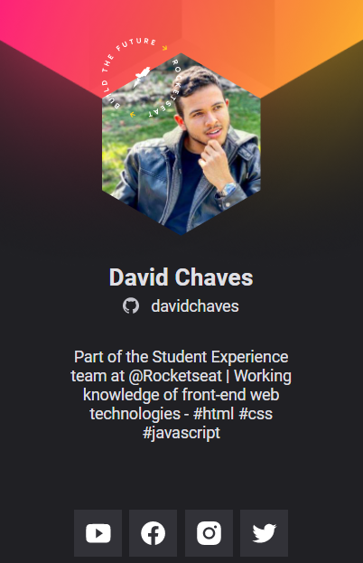

# NLW #Heat 2021

<h1 align="center">
  Virtual Badge DoWhile
</h1>

 

  

## 🚀 Technologies

This project was developed with the following technologies:

- HTML
- CSS
- JavaScript

## 💻 Project

The DoWhile Virtual Badge is a static application with the goal of showing the user information brought from the GitHub API and inserting it in a layout with the face of the DoWhile 2021 event.

Obs: This digital badge was created during the NLW/Heat event provided by @rocketseat-education. I was guided during 5 classes by [@maykbrito](https://github.com/maykbrito) and [@jakeliny](https://github.com/jakeliny). 

---

Feito com ♥ by [@davidchaves](https://github.com/davidchaves) :wave:.
